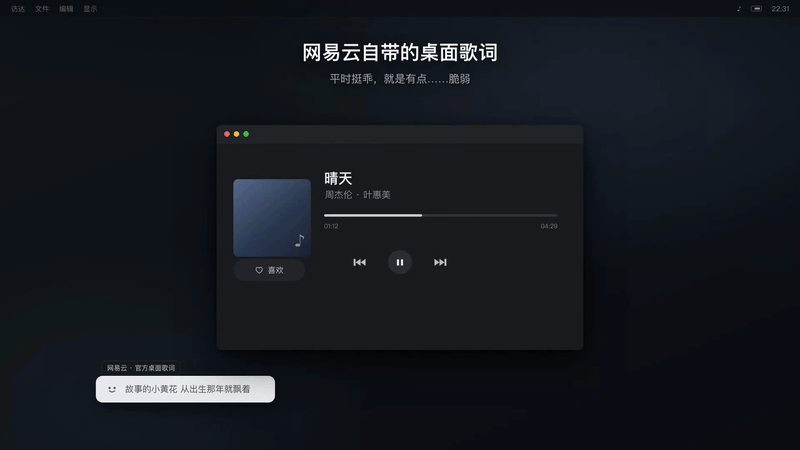
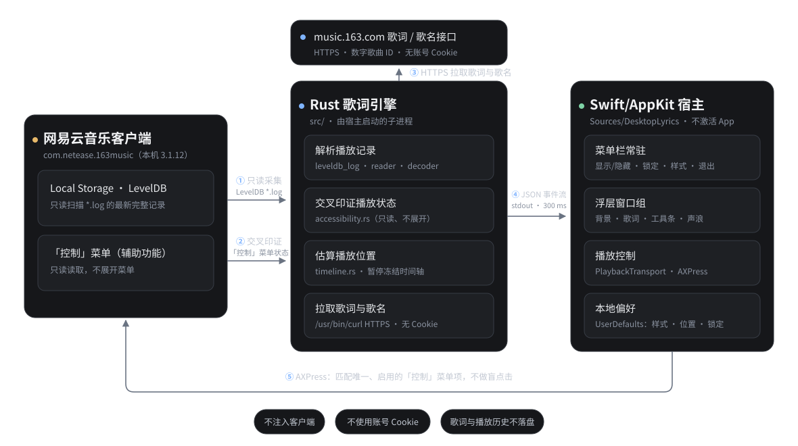

# 网易云音乐 macOS 桌面歌词

本地可运行的桌面歌词 MVP：**Rust** 只读识别网易云音乐的当前歌曲、播放位置和播放/暂停状态，获取并同步逐行歌词；**Swift/AppKit** 负责菜单栏、桌面浮层和通过辅助功能菜单执行播放控制；不注入网易云音乐，也不向播放器窗口发送盲目点击。



*概念演示动画（非实机录屏），源文件与重新渲染说明见 [`docs/demo/`](docs/demo/)。*

在 Apple Silicon、macOS **26.6.2**、网易云音乐 `com.netease.163music` **3.1.12** 上验证。网易云内部格式、菜单及歌词接口均非公开稳定 API，其他客户端版本须重新验收。

## 背景

网易云音乐 macOS 客户端自带桌面歌词，但两个最常见的场景都用不了：

- **不支持固定**：自带的桌面歌词无法锁定位置、固定在桌面上；
- **客户端窗口一放大，桌面歌词就没了**：想一边用放大的窗口、一边看歌词，自带的桌面歌词会直接消失。

官方客户端不开源、改不动，这个项目就用只读旁路补上这两点：一块独立的歌词浮层，**浮动在所有普通窗口之上**、跟随所有桌面空间，可拖动摆放，**锁定后固定不动、点击穿透**；播放器窗口放大或切换桌面，都不影响它。它不注入客户端、不向播放器窗口发送盲目点击，播放状态只从本地播放记录和辅助功能菜单里只读取得。

## 独立 App（推荐）

需要本机安装 Rust/Cargo、Apple Command Line Tools（`xcrun swiftc`）、网易云音乐，并联网。首次构建或代码更新后：

```bash
./scripts/build-app.sh
open "dist/网易云桌面歌词.app"
```

也可以在 Finder 双击 `dist/网易云桌面歌词.app`。App 自带 Rust 引擎，**不会借用终端的辅助功能授权**。本机已验证授权后的独立 App 可显示歌词。首次启动若出现“需要辅助功能权限”，在「系统设置 → 隐私与安全性 → 辅助功能」中允许**网易云桌面歌词**，然后退出并重新打开。不会代替你更改系统授权。

构建脚本使用本机 ad-hoc 签名，非公证/商店分发。**更新 App 会重新签名**：macOS 可能不再认可旧的辅助功能授权；若新包再次提示无权限，从辅助功能列表中移除旧的“网易云桌面歌词”，重新添加同一路径下的 App、打开开关，然后重启 App。不要在运行时重新构建或移动 App。

## 桌面就近操作

**只有一块圆角浮层背景**，不把按钮、歌词和声浪各画一张卡片。左上显示单行歌曲名，与右上工具和居中的播放三键共用顶行：放得下时就静止，放不下时以约 30 pt/s 缓慢跑马灯循环滚动（系统开启“减少动态效果”时保持截断静止），长歌名不会盖住按钮或播放键，歌曲名可在样式面板关闭；右上只有锁定／解锁、样式、吸附到屏幕右边三个图标，点箭头把整块浮层贴到当前屏幕右边缘（留 16 pt，垂直位置不变），拖动浮层即解除吸附。播放三键居中排在顶行，从左到右是上一首、稍醒目的播放／暂停、下一首，声浪仍在最底部。歌名、右上图标和播放三键**只在鼠标位于浮层范围内时显示**，鼠标离开约 0.4 s 后隐藏，只剩下歌词、声浪和背景；移到浮层任意位置立刻恢复，锁定状态下同样如此。顶栏与歌词带、歌词带与声浪各约 4 pt；歌词带本身的高度贴合可见文字，上下留白和字号可在样式面板调整，因此浮层总高度随歌词内容变化，顶栏位置不动。解锁时拖动灰色背景空白、两组图标的间隙或歌词文字，整块浮层都会移动；锁定后背景、歌词与声浪点击穿透，其他按钮仍可操作。隐藏歌词时所有窗口一同隐藏。

网易云未运行、辅助功能权限不足或菜单操作不明确时播放按钮会禁用、保留灰色图标但不拦截下方窗口的点击；播放／暂停状态只取自网易云的「控制」菜单。动作失败后对应按钮会保持禁用，菜单栏提供“播放控制失败，重新检查…”，不自动重试按键。合成预览的 `--stdin` 模式不会控制真实播放器。

主歌词和翻译／下一句**各最多两行**，两行之间保持固定的紧凑间距、整体居中且互不重叠，也不会贴到下方播放行；过长时缩小字号，仍放不下则省略，辅助功能文本保留完整原文。主行默认用宋体绘制，并按**逐行进度**扫光：已唱部分实墨、未唱部分淡墨，位置由引擎给出的行首／下一行时间戳推算，宿主在两次快照之间用本地单调时钟平滑推进。整条歌词时间轴再按样式面板里的**歌词延迟**整体后移（0–1000 ms，默认 200 ms）：播放器时钟总比耳朵听到的早一点，部分歌词文件也会把下一行的时间戳标在上一句唱完之前，觉得换行偏早就把这个值调大，偏晚就调小。暂停时停在原处；跳转或切歌时丢弃缓冲的行，从新位置所在的那行继续。权限、等待状态只显示居中必要文案。歌词区域内部不放按钮或进度；**下方横向声浪**的密集细柱随播放状态起伏（已播段用强调色），底栏高亮按**整首歌**位置与时长推进，不随每句歌词重新从零开始。暂停冻结、跳转和切歌立即取用新的估算位置；本地未解出歌曲时长时不画进度线，但仍按真实播放状态起伏，不把整首歌误判为已完成。无歌曲或系统启用“减少动态效果”时静止；它不是音频采样，**不使用麦克风或系统音频**。

样式面板可分别选择浮层背景色、文字颜色、文字背底色与强调色，调节浮层背景与文字背底不透明度（0% 为透明，100% 为不透明），并设置歌词上下留白（0–40 pt，默认 8 pt）、歌词字号（14–40 pt，默认 24 pt）、翻译字号（11–28 pt，默认 15 pt）和歌词延迟（0–1000 ms，默认 200 ms），并用「显示歌曲名」「显示声浪」两个开关决定这两处可选元素是否绘制（默认都开启；关掉声浪时底部整条波形和整首进度一起隐藏并停止起伏，浮层尺寸不变）。字号放不下时仍会自动缩小，缩小下限沿用 16 pt 和 12 pt，但不会高于所选字号。背景颜色和透明度只作用于整块浮层，不在三个位置重复绘制底色。面板不可拖动、标题栏没有关闭按钮，像弹出层一样关闭：**Esc、⌘W、点击面板外任意位置或窗口失去焦点**（点它唤起的取色面板属于同一次调色流程，不算失焦也不会关），关闭时取色面板一起收起；取色面板同样不可拖动、标题栏没有窗口按钮，并出现在所点色块旁边，而不是屏幕角落。文字背底贴合可见文本、默认透明；默认外观为「墨与纸」：暖纸底色、墨色宋体主行、朱砂强调色，“恢复默认”即还原这一套，已保存的自定义样式不受升级影响。样式（含两个显示开关）、右侧吸附、位置和锁定状态只存本机 App 偏好设置，不保存音乐资料。菜单栏音符保留显示／隐藏、锁定、样式、辅助功能设置及退出作为兜底。

## 终端脚本模式（备选）

若使用下面的脚本，请在辅助功能设置中允许**运行命令的终端**；它不会复用独立 App 的授权。

```bash
./scripts/run-desktop.sh
```

首次运行会在 `dist/` 构建应用；后续直接从该目录启动。关闭命令所在的终端或按 `Ctrl-C` 会结束浮层。改代码后先退出 App，再运行 `./scripts/build-app.sh`；不要在应用运行时重新构建。

本机检查：`./scripts/test-swift.sh`（单体背景几何、随内容变高的歌词带、鼠标离开后隐藏控件、拖动与锁定命中、右缘吸附与窄屏回退、长歌名跑马灯与减少动态效果回退、双行歌词、声浪与两个显示开关、样式与菜单安全匹配）、`cargo test`（Rust 引擎）。

## 技术实现

整体是**两个进程**：宿主 App（Swift/AppKit，`Sources/DesktopLyrics/`）负责所有窗口与鼠标交互；歌词引擎（Rust，`src/`）只读采集播放状态、请求歌词，并把结果写成 JSON 行。

下图是这套结构的运行关系与五条数据通道：



- **数据通道**。宿主把引擎作为子进程启动（`--lyrics-json --interval-ms 300`），逐行读取它的 stdout；每行是一条有界事件（`loading`／`title`／`intro`／`line`／`unavailable`），携带歌词文本、翻译、播放标记、估算位置 `position_ms`、时长 `duration_ms` 与短状态码，不含歌曲 ID。宿主限制单行 64 KiB、超限即丢弃，在主线程解码并刷新界面。`--stdin` 模式改为读合成事件，不启动引擎、也不控制真实播放器。
- **播放状态（Rust）**。只读解析网易云 Local Storage 的 LevelDB 物理日志（`leveldb_log.rs` 校验记录，`reader.rs`／`decoder.rs` 读取与解码），再与通过辅助功能读到的网易云「控制」菜单文案和启用状态（`accessibility.rs`，只读、不展开菜单）交叉印证；`timeline.rs` 用单调时钟估算位置、暂停时冻结时间轴，`playback.rs` 只在歌曲与状态互相确认后产出观测，`held_paused=true` 表示沿用同一进程内此前核验过的观测。
- **歌词与歌名（Rust）**。确认数字歌曲 ID 后，经系统 `/usr/bin/curl`（仅 HTTPS、不经 shell）请求 `music.163.com` 的歌词接口，`lrc.rs` 解析时间轴并配对原文与翻译；歌名走同域歌曲详情接口，限制体积与超时，ID 完全一致且标题非空才显示。不使用账号 Cookie，不落盘，缓存只活在本进程内。
- **播放控制（Swift）**。`PlaybackTransport.swift` 用辅助功能在网易云「控制」菜单里匹配唯一、启用且支持 AXPress 的菜单项并按下，不在播放器窗口做盲点击；AX 调用带 0.35 s 超时、串行在后台队列执行，结果回到主线程。可用性每 2 s 复查一次，动作失败后锁存为禁用，由菜单栏的「重新检查」解除。
- **桌面浮层（Swift/AppKit）**。不是一张大窗口，而是一组无边框 `NSPanel`：圆角背景＋单行歌名（`OverlayFrameView`）、歌词区（`LyricsView`）、工具条与播放键各自独立的图标命中窗口（`OverlayControls`，7 个图标面板＋2 个透明布局面板）、底部声浪（`WaveformRailView`）。全部位于 floating 层且不激活 App；只有图标接收鼠标事件，锁定后背景、歌词与声浪 `ignoresMouseEvents` 点击穿透。歌词带高度来自与 `layout()` 相同的测量（`LyricBand`），所以字号或留白变化只让浮层下缘移动；控件显隐由 `OverlayHover` 每 0.15 s 比较 `NSEvent.mouseLocation` 与背景范围决定，锁定的浮层收不到跟踪事件，因此不用 `NSTrackingArea`。拖动按位移增量移动，`OverlayVisibility` 约束整块浮层不越出可见屏幕；几何常量集中在 `OverlayLayout.swift` 与 `ToolbarPlacement.swift`，纯函数都有断言测试。样式经共享 `NSColorPanel` 调色后写入 `UserDefaults`。
- **构建与测试**。`scripts/build-app.sh` 组装 App：Rust release 引擎进 `Contents/Resources/`，`swiftc -O` 编译宿主进 `Contents/MacOS/`，改写 Info.plist 的 bundle id，ad-hoc 签名（引擎单独签 `…engine`）。`./scripts/test-swift.sh` 把宿主源码与 `tests/OverlayAppearanceTests/main.swift` 编成单二进制跑几何与交互断言，`cargo test` 覆盖引擎的日志解析、时间线与歌词逻辑。

## 诊断与隐私

```bash
cargo test
cargo run -- --once
cargo run -- --samples 120 --interval-ms 500
cargo run -- --lyrics-json --once
```

不传参数则每 500 ms 持续采样。普通 CLI 输出歌曲 ID、原始位置 `raw_ms`、估算位置 `estimated_ms`、`playing`、`held_paused`；**普通 CLI 可能显示真实歌曲 ID，不要上传输出**。JSON 行流只包含当前歌词、播放标记、估算位置 `position_ms`、歌曲时长 `duration_ms`（未解出时为 `null`）与短状态码，不含歌曲 ID 或原始日志；它本身仍会显示歌词，亦请勿分享真实输出。`raw_ms` 是最近一次本地记录，不一定实时；`estimated_ms` 用单调时钟估算，暂停时冻结；`held_paused=true` 表示沿用同一进程内此前核验过的观测，不是新采样。

歌词由数字歌曲 ID 向网易云 HTTPS 歌词接口请求，网络失败稍后重试；不使用账号 Cookie，不落盘歌词或播放历史。歌曲名是对**同一个已验证数字歌曲 ID** 的同域歌曲详情接口单独请求：严格限制体积与超时，只在返回单曲、ID 完全一致且标题非空时显示；该请求在歌词请求返回后才发出，不拖慢歌词，失败、离线或切歌后的迟到结果都会隐藏，缓存只存在于当前进程内存，退出即清。只读扫描网易云本机 `~/Library/Application Support/com.netease.163music/Documents/storage/CEFCache/Local Storage/leveldb/*.log` 的最新完整记录；播放控制通过辅助功能读取网易云的「控制」菜单，仅在操作唯一、启用且支持 AXPress 时重新校验并执行，不点击播放器窗口。权限、网络、格式变化、没有逐行歌词等问题会在浮层显示状态而非沿用旧歌词。客户端内网协议或歌词接口变更可能导致失效。

冷启动已暂停而没有新的本地播放记录时，宁可显示“等待当前歌曲”，不猜测历史歌曲；继续播放后等待新记录。首版不支持字级卡拉 OK、离线歌词、自动补第三方歌词源。验证记录和未覆盖场景见 [`docs/validation-checklist.md`](docs/validation-checklist.md)。

## 许可

本项目以 [MIT 许可](LICENSE) 发布：可自由使用、复制、修改、分发、再许可或销售，只需保留版权与许可声明。本项目为非官方第三方工具，与网易公司无关。

第三方致谢：灵感来自 [NeteaseMusicLrcHelper](https://github.com/Lensual/NeteaseMusicLrcHelper)，本地存储格式参考 [CloudLyrics-for-macOS](https://github.com/hellomyonly55/CloudLyrics-for-macOS)（MIT，引用其机制并保留其许可致谢），辅助功能思路参考 [CloudMusicFocus](https://github.com/eruimisshy/CloudMusicFocus)（GPL，没有复制其源码）。
